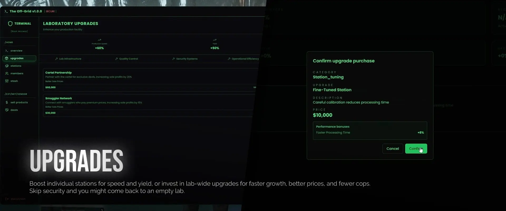
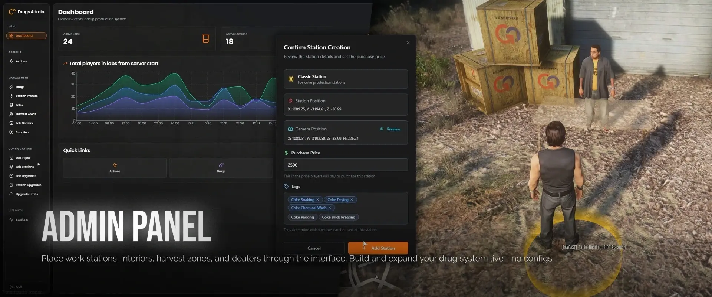
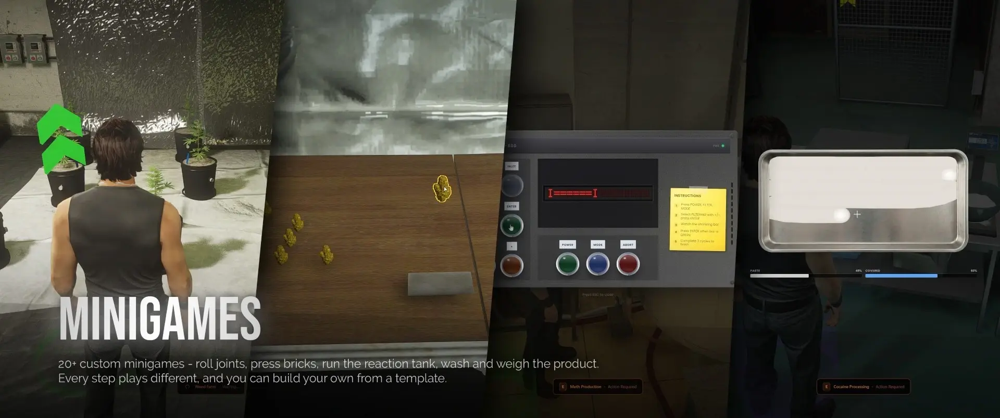

<div align="center">

# 💊 Lex Drug Creation System

### Create. Produce. Expand. Dominate.

A complete drug production, distribution and management framework for FiveM.

Design your own drugs, build custom production chains, operate laboratories, manage dealer networks, and create a fully configurable criminal economy directly from in-game administration tools.

---

<p align="center">
  
</p>

[]()
[]()
[]()
[]()
[]()

</div>

---

# 📖 Overview

Lex Drug Creation System is a complete criminal enterprise framework designed to provide long-term progression, deep production mechanics, and a fully player-driven drug economy.

Rather than forcing servers into predefined drug systems, Lex allows administrators to build their own drugs, production chains, laboratory setups, upgrades, and distribution networks entirely through an in-game administration interface.

No code editing.

No configuration files.

No server restarts.

Everything is managed live.

---

# 📸 Showcase

assets/Images/drugprod5.webp






# ✨ Core Features

## 🧪 Drug Creation System

Create entirely custom drugs from scratch.

Build unique production chains, define ingredients, assign minigames, and determine final outputs without touching a single line of code.

### Includes

- Unlimited drug creation
- Visual recipe editor
- Custom ingredients
- Configurable outputs
- Dynamic production chains
- Recipe presets
- Live editing
- Database persistence

Everything is created directly through the admin panel.

---

## ⚙️ Visual Recipe Editor

The heart of the system.

Design every production process step-by-step using an intuitive visual editor.

### Configure

- Required ingredients
- Production stages
- Minigames
- Animations
- Processing time
- Output products
- Success requirements

Production chains can be saved as reusable presets and loaded into any compatible laboratory station.

This allows a single station to produce completely different products depending on the recipe assigned.

---

## 🎮 Interactive Production Minigames

Production isn't just waiting for a timer to finish.

Every production stage can launch a fully interactive minigame.

More than **20 unique minigames** are included, specifically designed around drug manufacturing gameplay.

### Examples

#### Weed Production

- Joint Rolling
- Brick Pressing
- Packaging

#### Meth Production

- Chemical Reactions
- Temperature Control
- Crystallization

#### Coke Production

- Soaking
- Washing
- Drying
- Weighing

Each minigame includes its own interface, mechanics, and progression loop.

---

# 🏭 Laboratory System

Choose from three fully independent laboratory types.

Each lab contains its own interior, workflow, equipment, and production chain.

---

## 🌿 Weed Farms

Grow product from seed to harvest.

### Features

- Plant growth stages
- Harvesting
- Processing
- Packaging
- Growth upgrades

---

## ⚗️ Meth Labs

Operate a sequential chemical production line.

### Features

- Reaction Tanks
- Filtering Stations
- Crystallization
- Packaging

---

## ❄️ Coke Lockups

Run a complete cocaine processing operation.

### Features

- Soaking Barrels
- Chemical Washes
- Drying Ovens
- Weighing Stations

---

All laboratories use routing buckets, allowing multiple groups to operate identical labs without interfering with one another.

---

# 💊 Addiction System

Drugs have consequences.

Every consumable can contribute toward addiction progression.

Players who become addicted must continue consuming products or suffer withdrawal effects.

### Withdrawal Effects

- Blurred vision
- Screen shake
- Health deterioration
- Visual distortions

Each drug has configurable addiction strength and recovery rates.

Players who remain clean will naturally recover over time.

---

## 🚔 Risk-Based Consumption

Consumption locations matter.

Using drugs in high-income neighborhoods carries a higher chance of generating police dispatch alerts.

This creates meaningful risk versus reward decisions for players.

---

# 📈 Street Dealing Progression

Take your product directly to the streets.

Sell to pedestrians across Los Santos and Blaine County while building your criminal reputation.

---

## Dealer Skill Tiers

| Tier | Rank |
|--------|--------|
| I | Rookie |
| II | Hustler |
| III | Dealer |
| IV | Distributor |
| V | Boss |
| VI | Kingpin |

Progression rewards players with:

- Fewer refusals
- Reduced attack chance
- Lower police attention
- Increased sales success

---

## Demand-Based Economy

Different neighborhoods have different demands.

### Wealthy Areas

- Higher profits
- Greater police presence
- Increased dispatch chance

### Poor Areas

- Lower profits
- Reduced police risk
- Higher robbery potential

Players must learn where and when to sell.

---

# 🚚 Delivery Missions

Move larger quantities of product through active sale missions.

---

## Delivery Van Operations

Travel across the map completing multiple drop-offs.

### Features

- Dynamic routes
- Multiple destinations
- Ambush encounters
- Scalable rewards

---

## Aircraft Deliveries

Smuggle product through remote air routes.

### Features

- Hidden airstrips
- Remote drop zones
- Increased risk
- 1.5x payout multiplier

---

# 🤝 Dealer Network

Generate passive income through NPC distribution.

Deposit product into your network and allow dealers to move inventory automatically.

### Features

- Configurable timers
- Multiple active sales
- Adjustable profit percentages
- Upgrade support

Default values:

- 3 Hour Sale Time
- 80% Market Value

Fully configurable.

---

# 🔧 Laboratory Upgrades

Every laboratory can be expanded and improved.

### Upgrade Categories

#### Production

Increase crafting speed.

#### Yield

Produce more product per cycle.

#### Security

Prevent theft and robberies.

#### Sales

Increase profits.

#### Growth

Improve cultivation speed.

#### Heat Reduction

Reduce police attention.

---

Each upgrade supports:

- Multiple tiers
- Configurable prices
- Stack limits
- Live balancing

---

# 📓 In-Lab Management Notebook

Every laboratory contains a central management terminal.

Players can manage:

- Upgrades
- Member permissions
- Stash inventory
- Active sales
- Dealer networks
- Sell missions
- Production stations

All actions respect role-based permissions.

---

# 👥 Permissions & Gang Support

Granular access control allows complete laboratory ownership management.

### Permission Categories

- Enter Laboratory
- Operate Stations
- Access Stash
- Purchase Upgrades
- Start Missions
- Recruit Members

---

### Supported Gang Systems

- QBCore Gangs
- rcore_gangs

Or use standalone player ownership.

---

# 🌎 Harvest Locations

Populate the map with raw material gathering areas.

Configure:

- Spawn locations
- Item rewards
- Prop models
- Spawn amounts
- Respawn timers

Perfect for creating resource gathering routes before production begins.

---

# 🚨 Laboratory Robberies

Neglected operations attract unwanted attention.

Laboratories without security upgrades may experience:

- Product theft
- Production disruption
- Stash raids

Investing in security upgrades removes these risks entirely.

---

# 💨 Drug Consumption System

Finished products become fully interactive consumables.

### Includes

- Custom animations
- Prop attachments
- Bone attachments
- Walking style changes
- Consumption effects
- Addiction integration

Examples include:

- Smoking joints
- Using pipes
- Consuming powder products

---

# 📊 Live Laboratory Monitoring

Administrators receive a live overview of every active laboratory.

Monitor:

- Running stations
- Active recipes
- Progress percentages
- Player activity
- Dealer sales
- Production statistics

Perfect for moderation and economy balancing.

---

# 🛠️ Administration Panel

Open directly in-game.

```bash
/drugs_admin
```

Manage the entire ecosystem from a single interface.

### Administration Features

- Drug Creation
- Recipe Editor
- Laboratory Management
- Interior Registration
- Upgrade Configuration
- Dealer Placement
- Harvest Locations
- Live Monitoring
- Economy Balancing

All changes are applied instantly without requiring a server restart.

---

# 🎓 Tutorial System

New players receive guided tutorials when entering a laboratory for the first time.

### Benefits

- Faster onboarding
- Reduced support requests
- Improved player retention

Players can replay tutorials at any time.

---

# 📋 Feature Summary

### Drug Creation

- Unlimited Drugs
- Visual Recipe Builder
- Recipe Presets
- Live Editing

### Production

- Weed Farms
- Meth Labs
- Coke Lockups
- 20+ Minigames

### Economy

- Street Deals
- Delivery Missions
- Dealer Network

### Progression

- Dealer Skill System
- Laboratory Upgrades
- Dynamic Economy

### Immersion

- Addiction System
- Drug Consumption
- Police Dispatch
- Robbery Events

### Administration

- Full Admin Panel
- Live Monitoring
- Real-Time Configuration

---

# ⚙️ Dependencies

## Database

- oxmysql
- mysql-async
- ghmattimysql

## Frameworks

- ESX
- QB-Core
- QBOX

Bridge system is fully open for custom integrations.

---

# 📦 Installation

```cfg
ensure lex_drugs
```

1. Import the included SQL file.
2. Configure your framework bridge.
3. Start the resource.
4. Configure everything directly in-game.

---

# 📞 Support

## Discord

```text
coderlex
```


# ❤️ Credits

Developed by **Lex Developments**

NOTE: This is for showcase purpose only contact the developer for the full resources. 

Professional FiveM Development

- Optimized Performance
- Clean Architecture
- Premium User Experience
- Long-Term Support

---

<div align="center">

### ⭐ If you enjoy the project, consider reaching out to the 'coderlex' on discord. 

</div>
